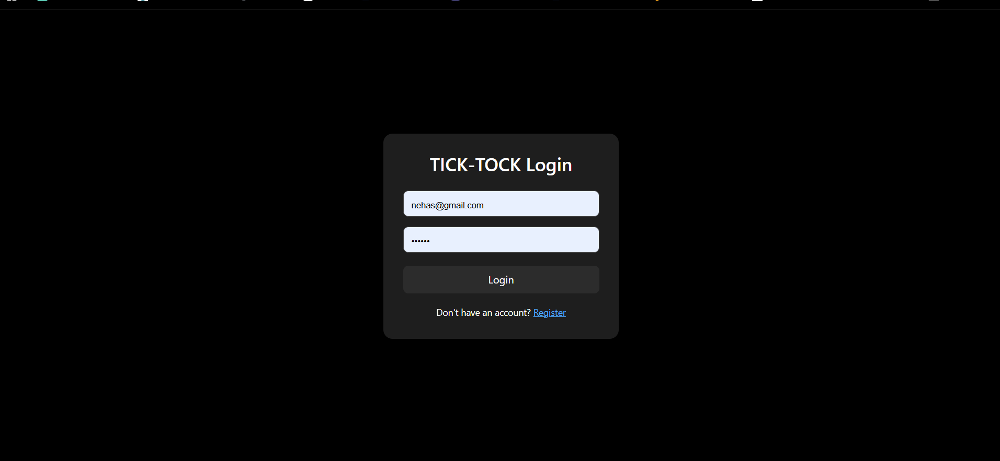
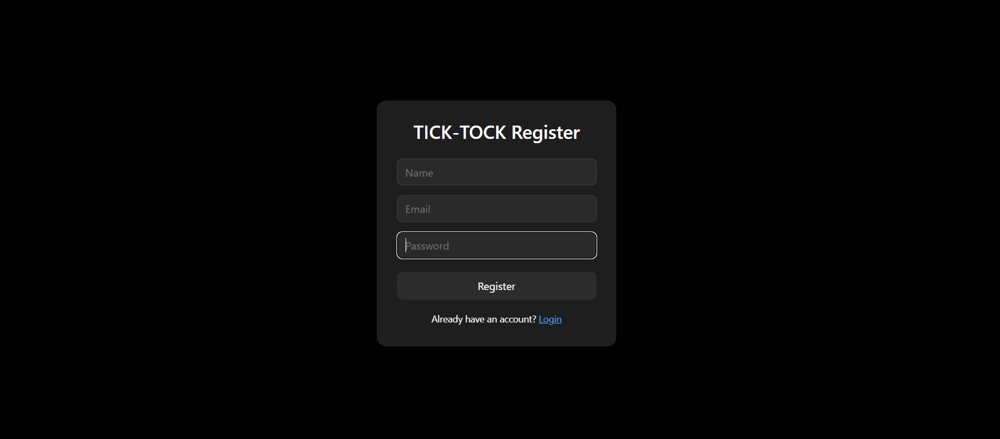
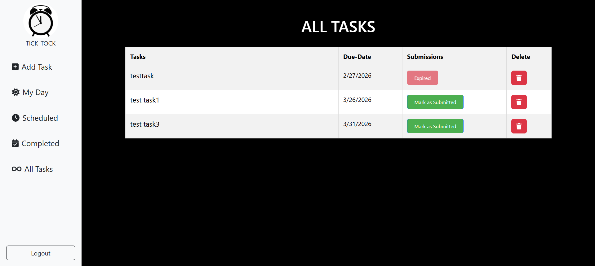
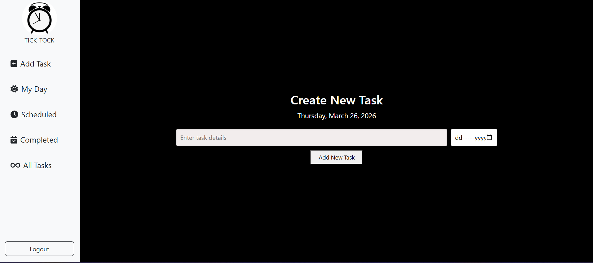
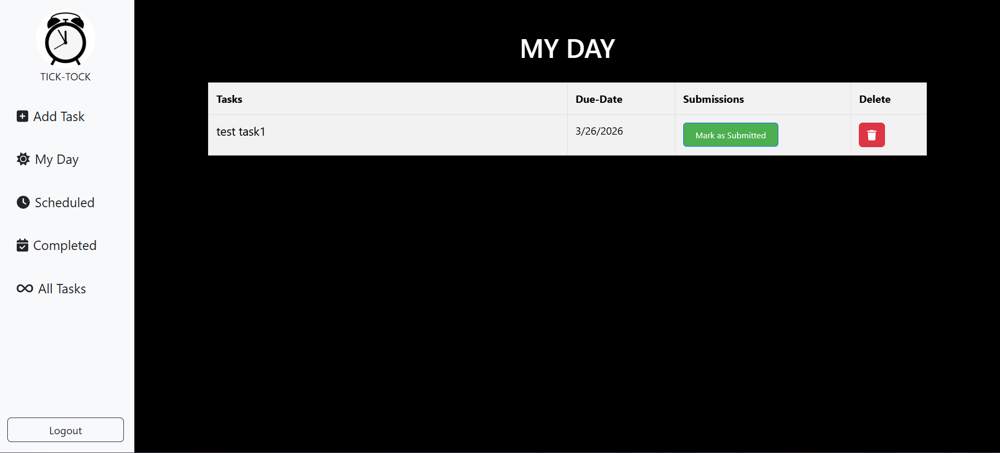
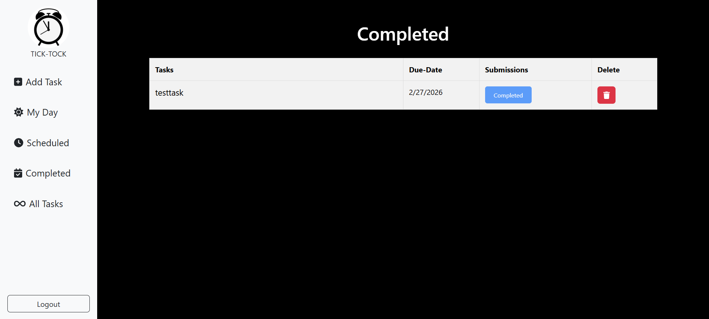
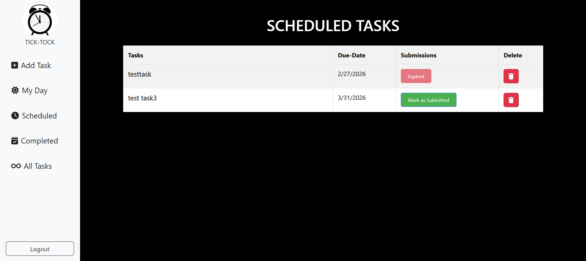

# 📝 ToDo List - Full Stack Task Manager

A full-stack task management web application that helps users
efficiently manage daily tasks with secure authentication and smart
filtering options.

The application allows users to create, update, delete, and track tasks
based on due dates such as Today, Pending, and Expired tasks.

------------------------------------------------------------------------

## 🚀 Live Demo

https://todo-list-frontend-ixan.onrender.com/

------------------------------------------------------------------------

## 📂 GitHub Repository

https://github.com/Nehas1312/ToDo-List

------------------------------------------------------------------------

## ✨ Features

-   User Authentication using JWT
-   Create new tasks
-   Edit existing tasks
-   Delete tasks
-   Due date support
-   Smart filters:
    -   Today's tasks
    -   Pending tasks
    -   Expired tasks
    -   Completed tasks
-   Protected routes for logged-in users
-   Fast and responsive UI
-   Deployed online

------------------------------------------------------------------------

## 🏗️ Tech Stack

### Frontend

-   React.js
-   JavaScript (ES6+)
-   CSS

### Backend

-   Node.js
-   Express.js

### Database

-   MongoDB

### Authentication

-   JSON Web Token (JWT)

### Deployment

-   Render

------------------------------------------------------------------------

## 🧠 Project Architecture

React Frontend → Express Backend → MongoDB Database

-   RESTful APIs handle CRUD operations
-   JWT token used for secure login sessions
-   Task filtering handled using date logic

------------------------------------------------------------------------

## 📸 Screenshots

### Login Page

### Register Page

### Dashboard

### Add Task

### Present Day

### Completed Tasks

### Pending Tasks

------------------------------------------------------------------------

## ⚙️ Installation & Setup

### 1️⃣ Clone repository

git clone https://github.com/Nehas1312/ToDo-List.git cd ToDo-List

------------------------------------------------------------------------

### 2️⃣ Setup Backend

cd backend npm install npm start

Create .env file:

MONGO_URI=your_mongodb_connection_string JWT_SECRET=your_secret_key

------------------------------------------------------------------------

### 3️⃣ Setup Frontend

cd frontend npm install npm start

------------------------------------------------------------------------

## 📡 API Endpoints

### Authentication

-   POST /api/auth/register
-   POST /api/auth/login

### Tasks

-   GET /api/tasks
-   POST /api/tasks
-   PUT /api/tasks/:id
-   DELETE /api/tasks/:id

------------------------------------------------------------------------

## 📈 Future Improvements

-   Task priority levels
-   Search functionality
-   Dark mode
-   Email reminders
-   Drag & drop task ordering

------------------------------------------------------------------------

## 👩‍💻 Author

Nehas Kandiraju

GitHub: https://github.com/Nehas1312 LinkedIn:
https://linkedin.com/in/Nehas1312

------------------------------------------------------------------------

⭐ If you like this project, give it a star on GitHub!
